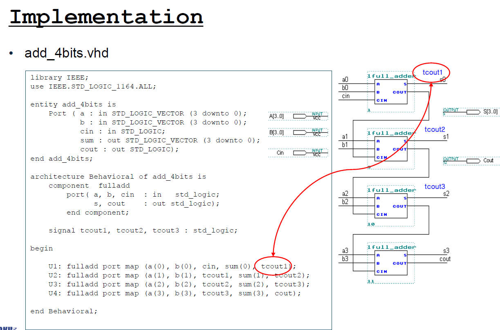
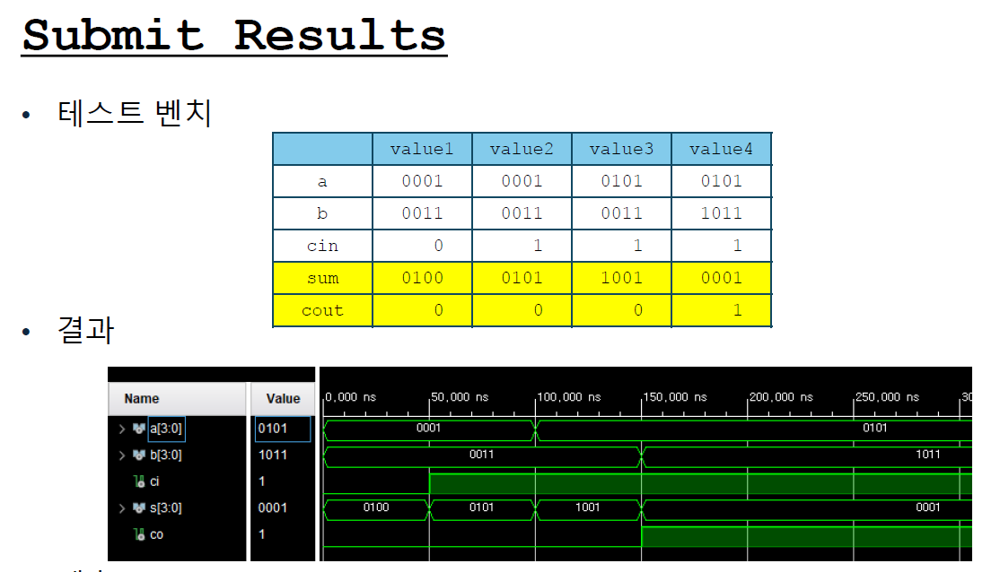
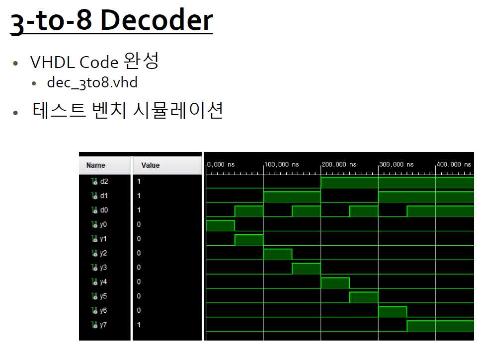
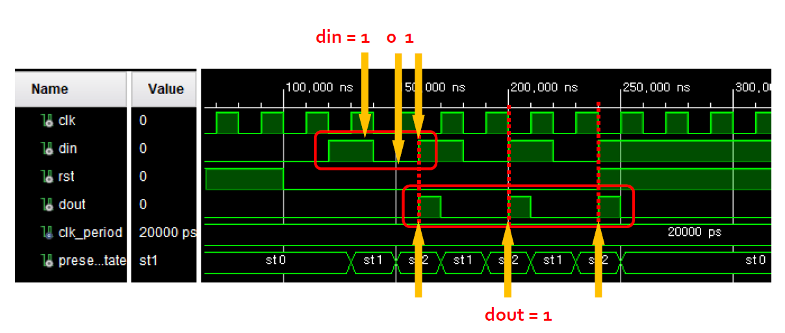
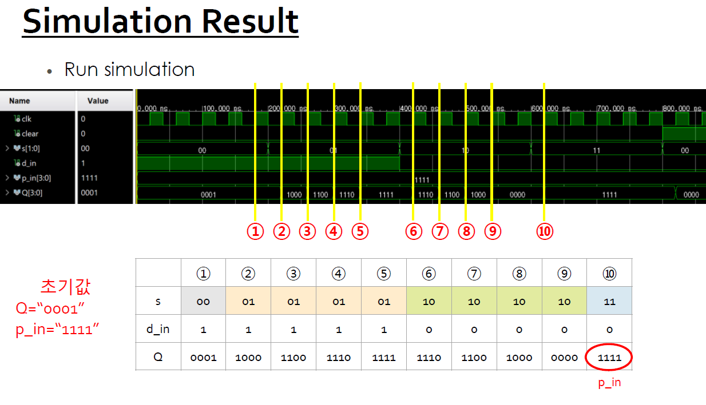

# Controller Logic — VHDL 설계와 Portable Verification

**학기:** 2-2 · **프로젝트 유형:** Team Project · Individual contribution unconfirmed
**Evidence:** Recovered Original · Portable Reconstruction · GHDL Rerun


## RTL 범위와 실행 도구

조합회로에서 FSM·범용 시프트 레지스터까지 7개 RTL 블록을 self-checking testbench로 재검증했습니다.

| 항목 | 내용 |
|---|---|
| 공개 상태 | GHDL 7/7 PASS |
| 소스 상태 | Recovered Original · Portable Reconstruction · GHDL Rerun |
| Web case study | [https://tontonjeong.github.io/electrical-engineering-coursework-portfolio/courses/controller-logic/](https://tontonjeong.github.io/electrical-engineering-coursework-portfolio/courses/controller-logic/) |

## 원본 소스와 portable 검증 분리

과제 원본의 핵심은 단일 회로가 아니라, 논리식 → 계층화 → 상태기계 → 레지스터 제어로 확장되는 RTL 사고 과정입니다. 회수된 소스만으로는 모든 블록을 동일 환경에서 검증할 수 없었기 때문에, 원본과 재구성을 디렉터리·표시·검증 결과에서 분리했습니다.

### 적용한 설계 조건

1. 작은 조합회로는 입력공간을 완전탐색해 예제 벡터만 맞는 착시를 제거했습니다.
2. 순차회로는 reset, hold, load, 양방향 shift, overlap 검출을 directed test로 분리했습니다.
3. 비표준 산술 패키지 의존을 피하고 공개 재구성 testbench에는 numeric_std를 사용했습니다.
4. 모든 testbench는 assertion 실패 시 CI가 실패하고, 성공 시 PASS와 VCD를 남깁니다.

## 상세 근거와 분리된 하위 사례

- [Local GHDL 6.0.0 verification summary](results/verification_summary.md)

## 설계 구조


## Regression 결과

| Metric | Value |
|---|---:|
| Design units | 7 |
| Recovered Vivado projects | 4 |
| Original stimuli | 4 STIMULUS_COMPLETE |
| Self-checking TB | 7 |
| Regression | 7 PASS / 0 FAIL |
| Local tool | GHDL 6.0.0 mcode |

## 게이트 구조와 GHDL 파형

### 1-bit full-adder gate structure

**Portfolio Redraw**


### 4-bit ripple-carry hierarchy

**Portfolio Redraw**


### Overlapping 101 Mealy FSM

**Portfolio Redraw**


### Hold, shift, and load modes

**Portfolio Redraw**


### Exhaustive adder regression waveform

**Portable GHDL Result**


### Directed overlapping-sequence waveform

**Portable GHDL Result**


## 회수된 Vivado/XSim 화면

학번·개인정보·로컬 경로·제3자 교재를 제외한 원본 결과 화면입니다.

### 4-bit adder hierarchy and carry-chain mapping

**Source-Derived**



### Directed adder vectors and Vivado waveform

**Source-Derived**



### Exhaustive 3-to-8 decoder waveform

**Source-Derived**



### Annotated overlapping-101 Mealy waveform

**Source-Derived**



### Hold, shift, and load mode waveform

**Source-Derived**



## VHDL entity와 assertion testbench

### Full-adder concurrent assignments

**Recovered Original**


### Mealy detector state logic

**Recovered Original**


### Universal shift-register mode selection

**Portable Reconstruction**


## 합성·보드 검증 범위

> 원본 Vivado 2023.2 프로젝트와 XSim context 4건은 회수했지만, device constraint, synthesis/timing report, 보드 실증은 없습니다. 원본 testbench에는 assertion이 없어 STIMULUS_COMPLETE로만 표시하고, PASS는 별도 self-checking GHDL 6.0.0 suite에만 부여합니다. LUT/FF, Fmax, 전력, hardware PASS는 주장하지 않습니다.

## 소스·로그·VCD

```bash
python scripts/run_all_calculations.py
python scripts/validate_publication.py
```

세부 소스·계산·로그는 실제 존재하는 `src/`, `tb/`, `calculations/`, `data/`, `results/` 경로에서 확인합니다.

- [Visual case study](https://tontonjeong.github.io/electrical-engineering-coursework-portfolio/courses/controller-logic/)
- [Portfolio home](../../README.md)
- [Asset manifest](../../docs/assets/asset_manifest.yaml)
- [Source provenance](../../SOURCE_PROVENANCE.md)
