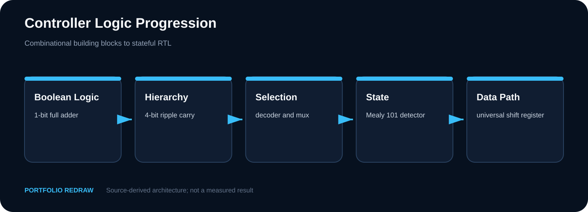
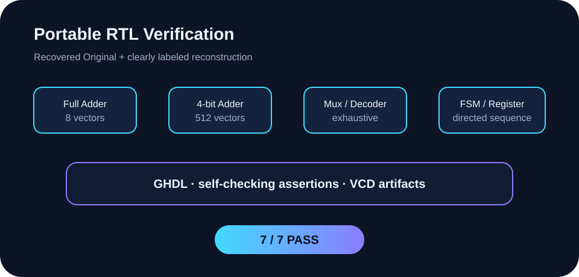
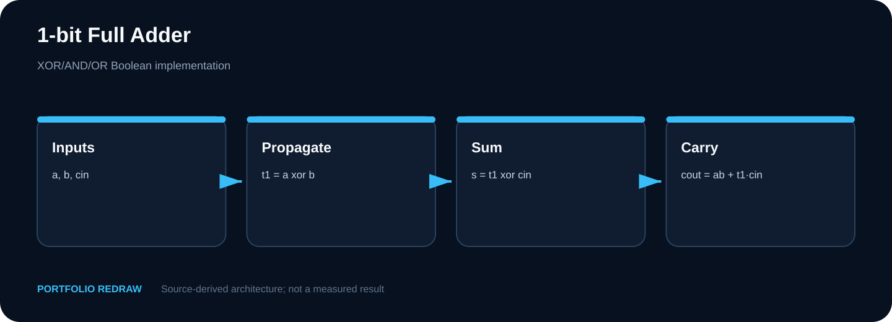
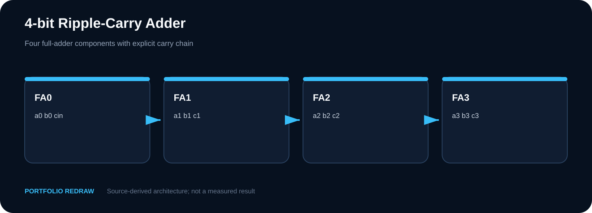
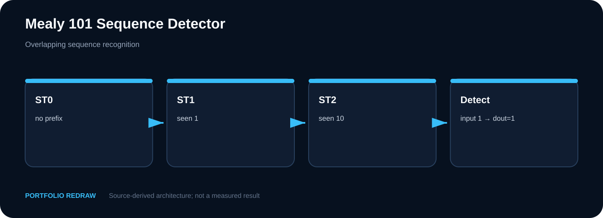
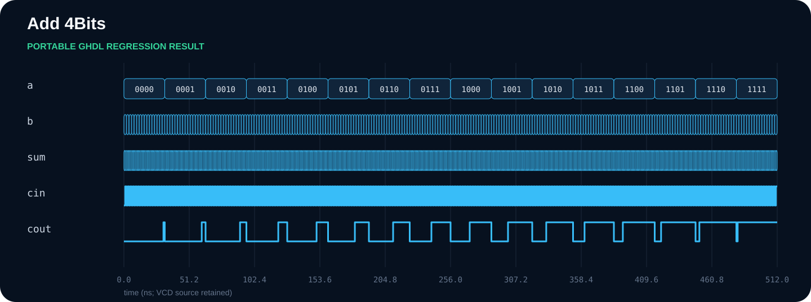
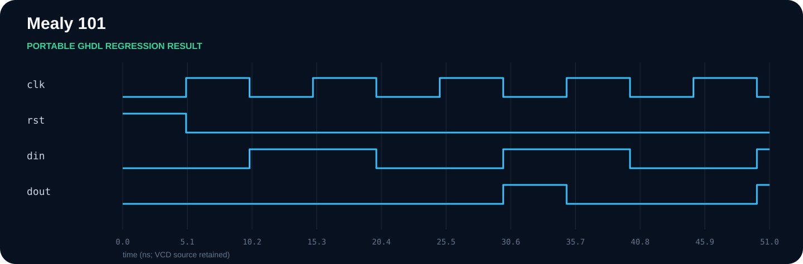
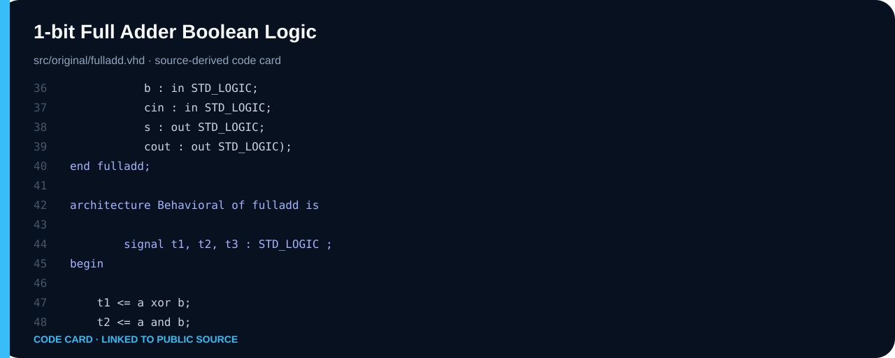
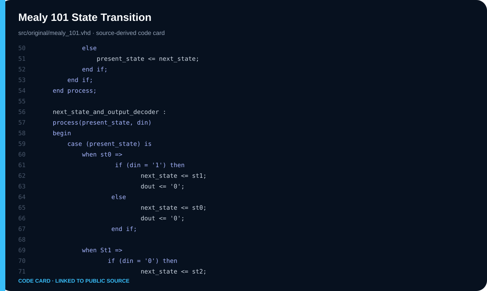
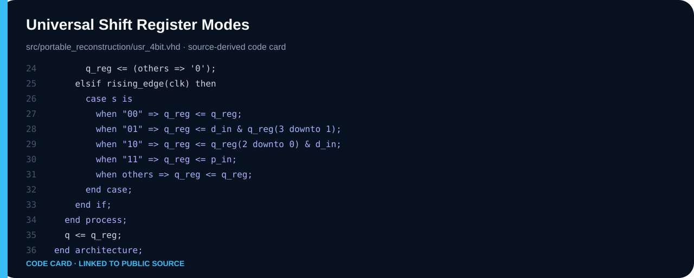

# Controller Logic — VHDL 설계와 Portable Verification

**학기:** 2-2 · **프로젝트 유형:** Team Project · Individual contribution unconfirmed
**Evidence:** Recovered Original · Portable Reconstruction · GHDL Rerun



## 30초 요약

조합회로에서 FSM·범용 시프트 레지스터까지 7개 RTL 블록을 self-checking testbench로 재검증했습니다.

| 항목 | 내용 |
|---|---|
| 공개 상태 | GHDL 7/7 PASS |
| 소스 상태 | Recovered Original · Portable Reconstruction · GHDL Rerun |
| Web case study | [https://tontonjeong.github.io/electrical-engineering-coursework-portfolio/courses/controller-logic/](https://tontonjeong.github.io/electrical-engineering-coursework-portfolio/courses/controller-logic/) |

## 문제 정의

과제 원본의 핵심은 단일 회로가 아니라, 논리식 → 계층화 → 상태기계 → 레지스터 제어로 확장되는 RTL 사고 과정입니다. 회수된 소스만으로는 모든 블록을 동일 환경에서 검증할 수 없었기 때문에, 원본과 재구성을 디렉터리·표시·검증 결과에서 분리했습니다.

## 설계 판단

1. 작은 조합회로는 입력공간을 완전탐색해 예제 벡터만 맞는 착시를 제거했습니다.
2. 순차회로는 reset, hold, load, 양방향 shift, overlap 검출을 directed test로 분리했습니다.
3. 비표준 산술 패키지 의존을 피하고 공개 재구성 testbench에는 numeric_std를 사용했습니다.
4. 모든 testbench는 assertion 실패 시 CI가 실패하고, 성공 시 PASS와 VCD를 남깁니다.

## 구조와 설계 흐름



## 핵심 수치

| Metric | Value |
|---|---:|
| Design units | 7 |
| Self-checking TB | 7 |
| Regression | 7 PASS / 0 FAIL |
| Portable target | Ubuntu + GHDL |

## 시각 근거

### 1-bit full-adder gate structure

**Portfolio Redraw**



### 4-bit ripple-carry hierarchy

**Portfolio Redraw**



### Overlapping 101 Mealy FSM

**Portfolio Redraw**



### Hold, shift, and load modes

**Portfolio Redraw**


### Exhaustive adder regression waveform

**Portable GHDL Result**



### Directed overlapping-sequence waveform

**Portable GHDL Result**



## 코드 근거

### Full-adder concurrent assignments

**Recovered Original**



### Mealy detector state logic

**Recovered Original**



### Universal shift-register mode selection

**Portable Reconstruction**



## 검증 상태

| 질문 | 답변 |
|---|---|
| 지금 재현 가능한가? | GHDL 7/7 PASS 범위에서 가능 |
| 과거 결과 화면인가? | Existing Result Archive로 표시된 항목만 해당 |
| 재구성인가? | Portable Reconstruction 또는 Portfolio Redraw로 표시 |
| 실물 구현인가? | 원본이 지원하지 않으면 주장하지 않음 |

## 검증 경계

> 원본 Vivado 프로젝트, device constraint, synthesis/timing report, 보드 실증 자료는 확인되지 않았습니다. 따라서 LUT/FF, Fmax, 전력, hardware PASS는 주장하지 않습니다. 재구성 usr_4bit의 asynchronous clear는 공개 검증용 가정입니다.

## 재현 절차

```bash
python scripts/run_all_calculations.py
python scripts/validate_publication.py
```

세부 소스와 계산은 이 디렉터리의 `src/`, `tb/`, `calculations/`, `data/`, `results/` 중 존재하는 경로를 참조합니다.

## Source classification

- **Source-Derived:** 보고서 또는 회수 소스에 직접 존재
- **Portable Reconstruction:** 공개 검증을 위해 기능을 재작성
- **Independent Recalculation:** 원본 입력을 별도 코드로 계산
- **Existing Result Archive:** 과거 제출물의 결과 화면
- **Portfolio Redraw:** 공개 설명을 위한 재도식화
- **Publicly Withheld:** 개인정보·라이선스·제3자 권리 때문에 미공개

## Navigation

- [Visual case study](https://tontonjeong.github.io/electrical-engineering-coursework-portfolio/courses/controller-logic/)
- [Portfolio home](../../README.md)
- [Asset manifest](../../docs/assets/asset_manifest.yaml)
- [Source provenance](../../SOURCE_PROVENANCE.md)

<!-- Source-bounded case study; no unsupported claim is implied. -->

<!-- Source-bounded case study; no unsupported claim is implied. -->

<!-- Source-bounded case study; no unsupported claim is implied. -->

<!-- Source-bounded case study; no unsupported claim is implied. -->

<!-- Source-bounded case study; no unsupported claim is implied. -->
