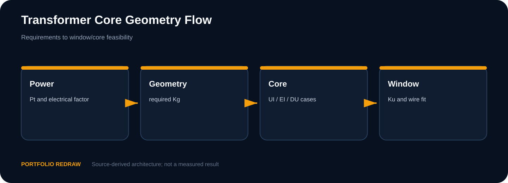
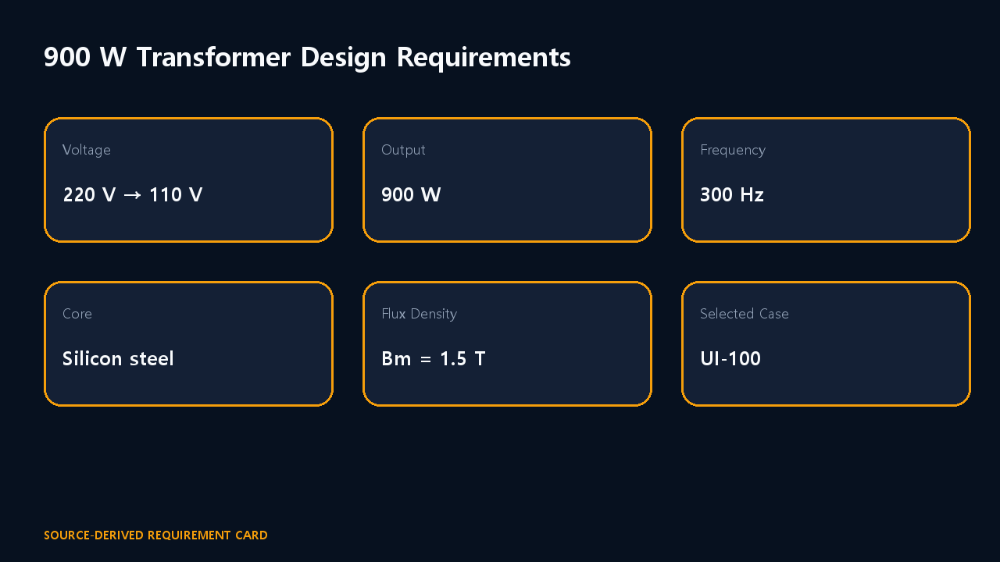
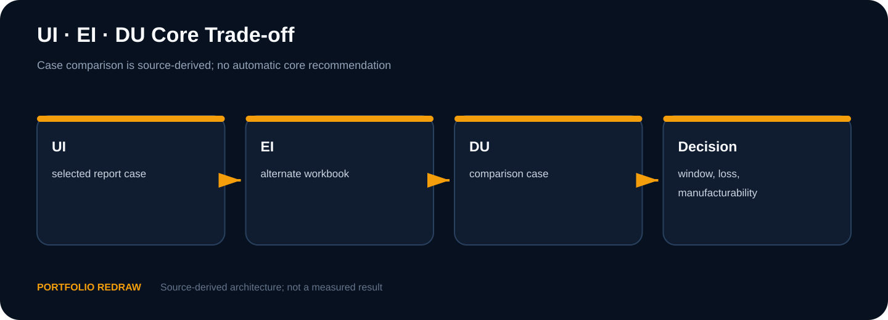
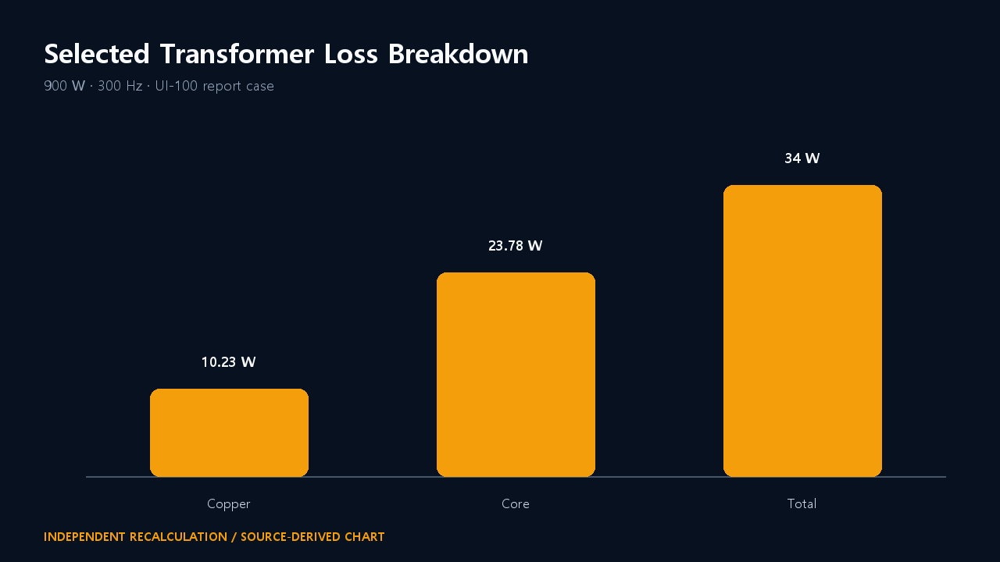
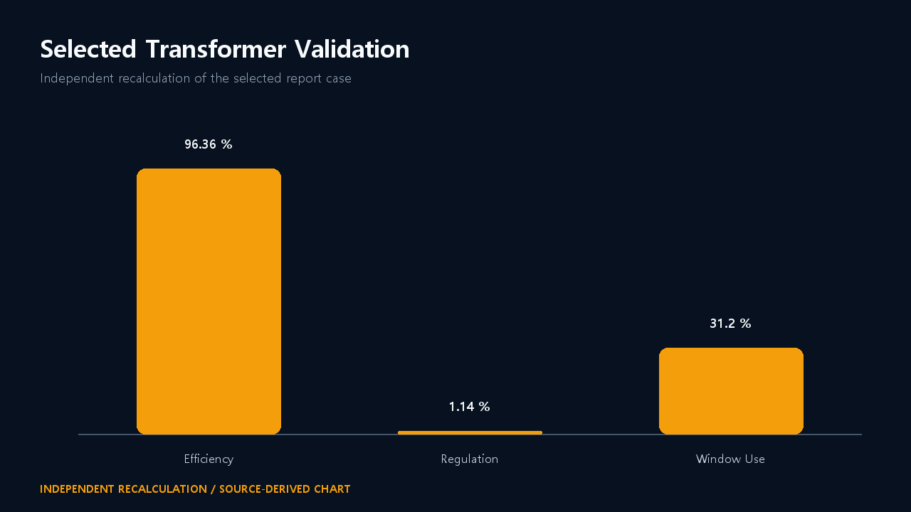
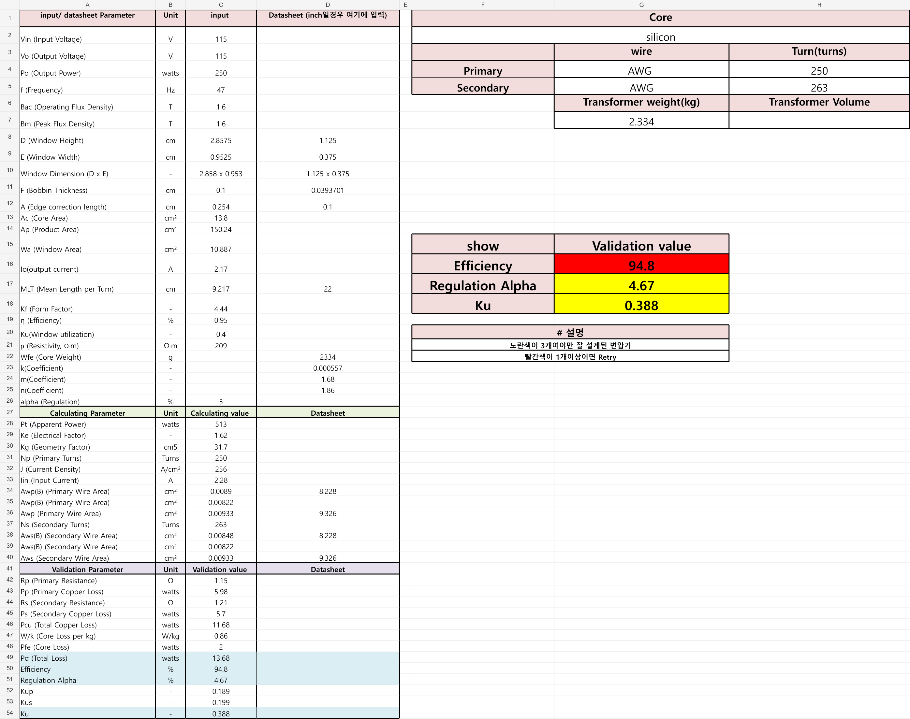
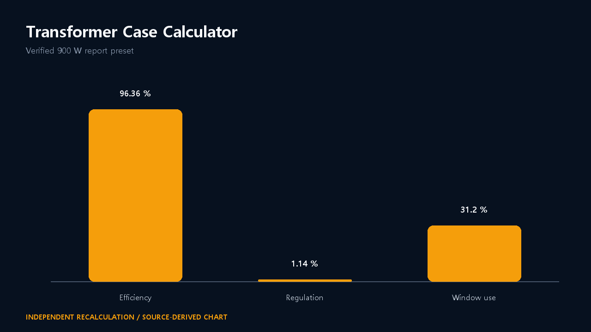
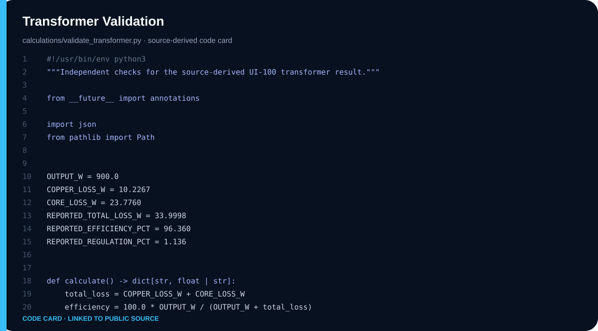

# Electrical Machines — 900 W 변압기 설계

**학기:** 3-1 · **프로젝트 유형:** Team Project · Individual contribution unconfirmed
**Evidence:** Source-Derived · Workbook Snapshot · Independent Recalculation


## 900 W 변압기 설계 조건

220/110 V, 900 W, 300 Hz 조건에서 DU·EI·UI 코어를 계산 비교하고 UI-100 설계를 선택했습니다.

| 항목 | 내용 |
|---|---|
| 공개 상태 | Independent recalculation |
| 소스 상태 | Source-Derived · Workbook Snapshot · Independent Recalculation |
| Web case study | [https://dororok9061.github.io/electrical-engineering-coursework-portfolio/courses/electrical-machines/](https://dororok9061.github.io/electrical-engineering-coursework-portfolio/courses/electrical-machines/) |

## UI·EI·DU 코어 후보 계산

정격 요구에서 권선수와 도체를 산정하고, 동손·철손·효율·전압변동률·창 이용률을 계산해 서로 다른 코어 형상을 비교했습니다. 최종 선택은 단일 최고 수치가 아니라 효율과 전압변동률, 창 이용률을 함께 본 trade study입니다.

### 적용한 설계 조건

1. 설계 입력은 220/110 V, 900 W, 300 Hz, silicon steel, Bmax 1.5 T로 고정했습니다.
2. DU-75, EI-112 초기·재설계, UI-100 사례를 동일한 판단 축으로 비교했습니다.
3. UI-100 최종안은 1차 180회, 2차 93회, 효율 96.360%, 전압변동률 1.136%로 정리했습니다.
4. 회수 workbook 중 다른 입력 조건과 #VALUE! 오류는 최종 설계 근거와 분리했습니다.

## 상세 근거와 분리된 하위 사례

- [Report case and workbook reconciliation](source_case_reconciliation.md)

## 설계 구조



## 후보별 계산 결과

| Metric | Value |
|---|---:|
| Primary / secondary | 180 / 93 turns |
| Copper loss | 10.2267 W |
| Core loss | 23.7760 W |
| Efficiency | 96.360% |
| Regulation | 1.136% |

## 권선·손실·효율 계산

### Source-derived design requirements

**Portfolio Redraw**



### Core trade-space comparison

**Portfolio Redraw**



### Final-case loss accounting

**Independent Recalculation**



### Efficiency and regulation comparison

**Portfolio Redraw**



### Rendered cell values; original workbook withheld

**Workbook Snapshot**



### Portable report-case recalculation

**Calculator Snapshot**



## 독립 재계산식

### Loss and efficiency equations

**Independent Recalculation**



## 제작·온도·절연 시험 범위

> 최종 제작, 온도상승, 절연 내력, 무부하·단락 시험의 실물 증거는 확인되지 않았습니다. 결과는 계산 기반 설계입니다. Workbook 화면은 셀 값을 렌더링한 snapshot이며 Excel 애플리케이션 실행 화면이 아닙니다.

## Workbook 감사와 계산 코드

```bash
python scripts/run_all_calculations.py
python scripts/validate_publication.py
```

세부 소스·계산·로그는 실제 존재하는 `src/`, `tb/`, `calculations/`, `data/`, `results/` 경로에서 확인합니다.

- [Visual case study](https://dororok9061.github.io/electrical-engineering-coursework-portfolio/courses/electrical-machines/)
- [Portfolio home](../../README.md)
- [Asset manifest](../../docs/assets/asset_manifest.yaml)
- [Source provenance](../../SOURCE_PROVENANCE.md)
