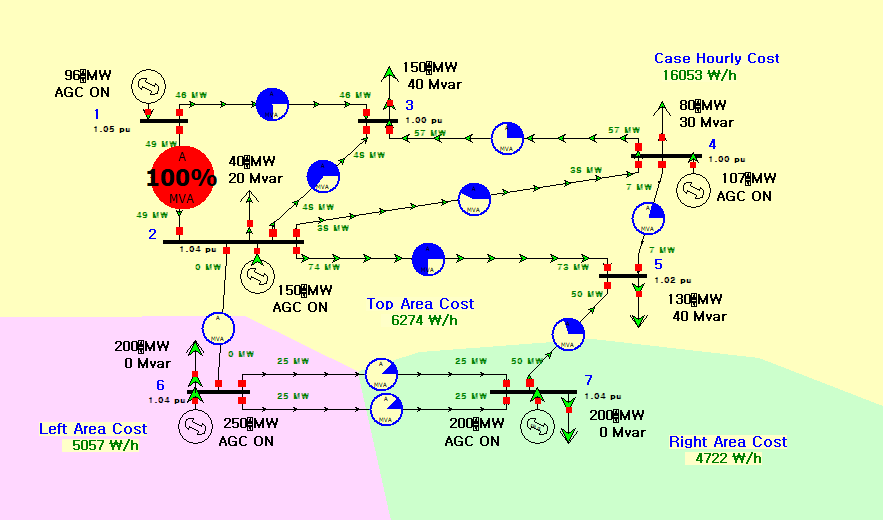
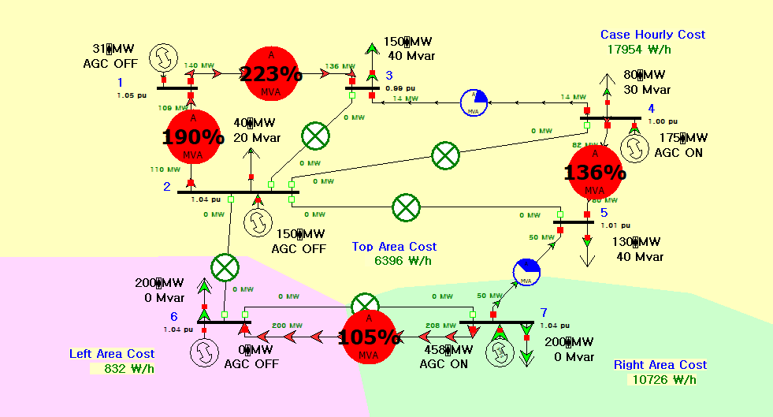

# Power Systems — 765 kV 송전선로와 전력정책 검토

**학기:** 3-1 · **프로젝트 유형:** Team Project · Individual contribution unconfirmed
**Evidence:** Source-Derived · Independent Recalculation · PowerWorld 24 Tool Rerun


## 765 kV 선로 입력과 실행 상태

분포정수 선로의 Zc·SIL을 재계산하고, PowerWorld 비수렴 결과와 정책 수치를 서로 다른 증거로 분리했습니다.

| 항목 | 내용 |
|---|---|
| 공개 상태 | Zc 255.38 Ω · SIL 2.292 GW · PWB rerun: Blackout |
| 소스 상태 | Source-Derived · Independent Recalculation · PowerWorld 24 Tool Rerun |
| Web case study | [https://tontonjeong.github.io/electrical-engineering-coursework-portfolio/courses/power-systems/](https://tontonjeong.github.io/electrical-engineering-coursework-portfolio/courses/power-systems/) |

## 선로 계산과 조류해석 결과 분리

계산 가능한 전송선로 파라미터, 수렴하지 않은 모델 화면, 정책 보고서 수치를 한 가지 ‘결과’로 묶지 않고 증거 수준을 분리하는 것이 핵심입니다. 선로 계산은 독립 재계산했고, 모델 비수렴은 디버깅 증거로만 남겼습니다.

### 적용한 설계 조건

1. 765 kV, 350 km, z=j0.3 Ω/km, y=j4.6 µS/km 조건으로 lossless Zc와 SIL을 계산했습니다.
2. 독립 계산 결과 Zc≈255.38 Ω, SIL≈2.292 GW, SIL 전류≈1.729 kA입니다.
3. PowerWorld full-load case의 비현실적 pu 전압과 blackout 상태는 실제 계통 성능으로 해석하지 않았습니다.
4. 설치된 PowerWorld 24에서 `newcase.pwb`의 2214 MW 저장 상태를 Newton 해석했고 실제 Blackout을 재현했습니다.
5. 2038 수요·피크·설비 수치는 보고서와 공개 정책 출처의 맥락을 분리해 표시했습니다.

## 상세 근거와 분리된 하위 사례

- [PowerWorld 24 source-case rerun record](powerworld_24_rerun.md)

## 설계 구조


## 계산값과 solver 상태

| Metric | Value |
|---|---:|
| Voltage / length | 765 kV / 350 km |
| Surge impedance | 255.38 Ω |
| SIL | 2.292 GW |
| SIL current | 1.729 kA |
| PowerWorld 24 rerun | 2214 MW → Blackout |
| 2038 energy | 735.1 → 624.5 TWh |
| 2038 peak | 145.6 → 129.3 GW |

## Zc·SIL·수요 수치

### Distributed-line calculation flow

**Portfolio Redraw**


### 2038 energy demand comparison

**Source-Derived Redraw**


### 2038 peak-demand comparison

**Source-Derived Redraw**


### Confirmed effective capacity values

**Source-Derived Redraw**


### Recovered one-line model view

**Existing PowerWorld Archive**


### Non-convergence evidence; not a validated grid result

**Existing PowerWorld Archive**


## PowerWorld 모델 화면

학번·개인정보·로컬 경로·제3자 교재를 제외한 원본 결과 화면입니다.

### Multi-area PowerWorld baseline model

**Source-Derived**



### Overload and outage case; not a validated grid result

**Diagnostic Evidence**



## 선로 재계산식

### Zc, SIL, and current equations

**Independent Recalculation**


## Blackout 진단과 보고서 수치 경계

> PowerWorld 24 재실행은 2214 MW 저장 상태에서 Blackout 진단을 확인한 것이며, 보고서의 3000/3100/3200 MW 단계나 5380 MW 보상 사례를 검증한 것이 아닙니다. 동적 안정도, 보호계전, N-1, 실계통 검증은 주장하지 않습니다. 화면의 이름·학번은 공개하지 않습니다.

## 계산 코드와 PowerWorld 실행 기록

```bash
python scripts/run_all_calculations.py
python scripts/validate_publication.py
```

세부 소스·계산·로그는 실제 존재하는 `src/`, `tb/`, `calculations/`, `data/`, `results/` 경로에서 확인합니다.

- [Visual case study](https://tontonjeong.github.io/electrical-engineering-coursework-portfolio/courses/power-systems/)
- [Portfolio home](../../README.md)
- [Asset manifest](../../docs/assets/asset_manifest.yaml)
- [Source provenance](../../SOURCE_PROVENANCE.md)
