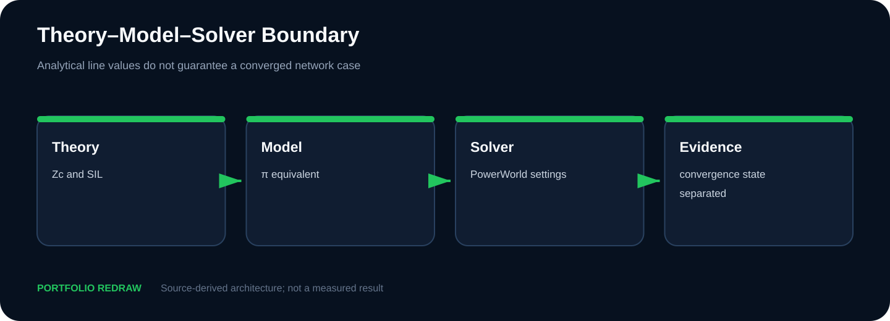
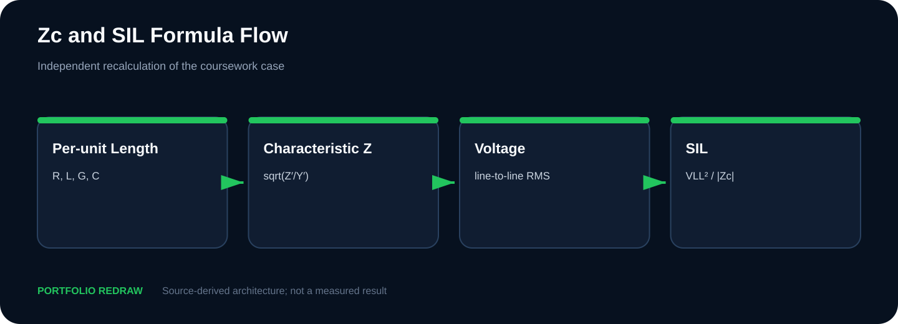
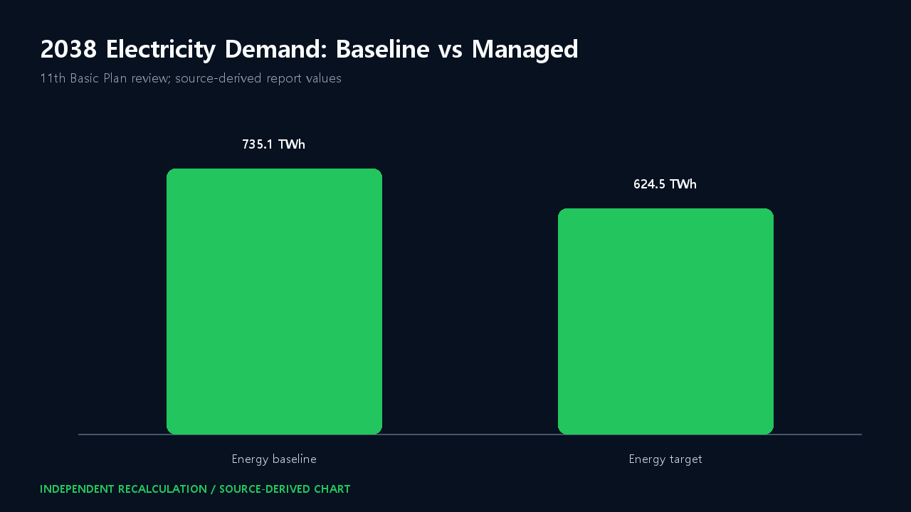
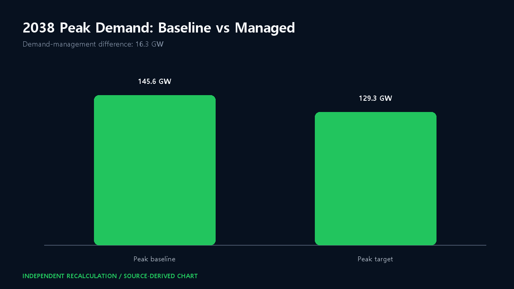
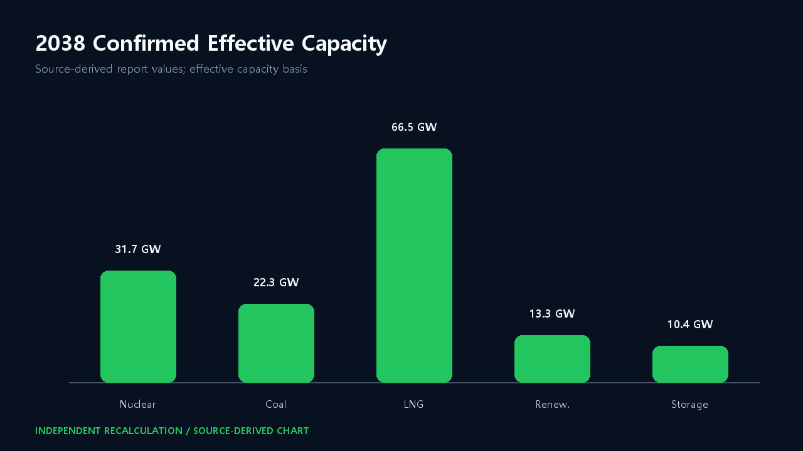
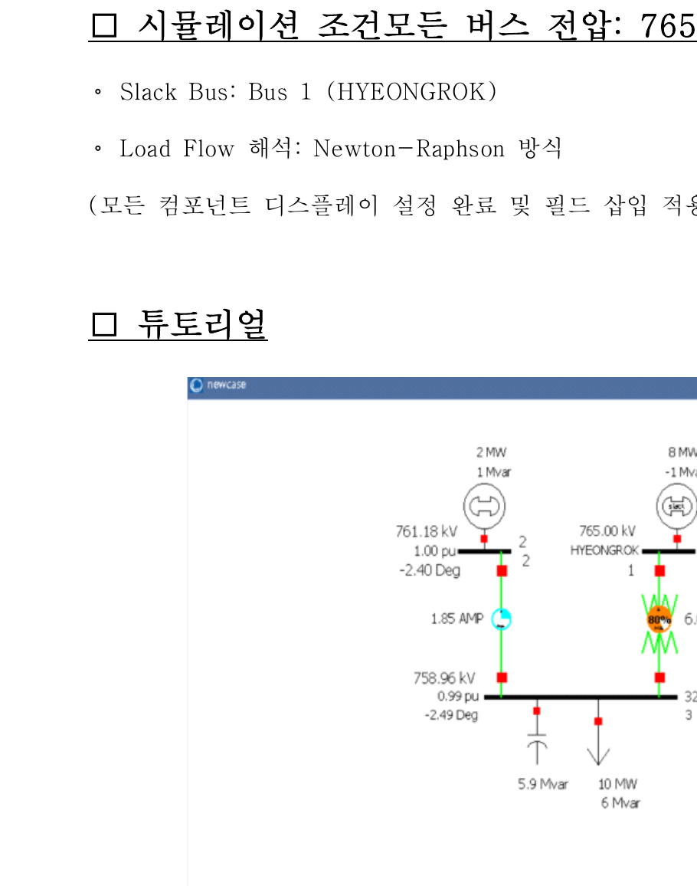
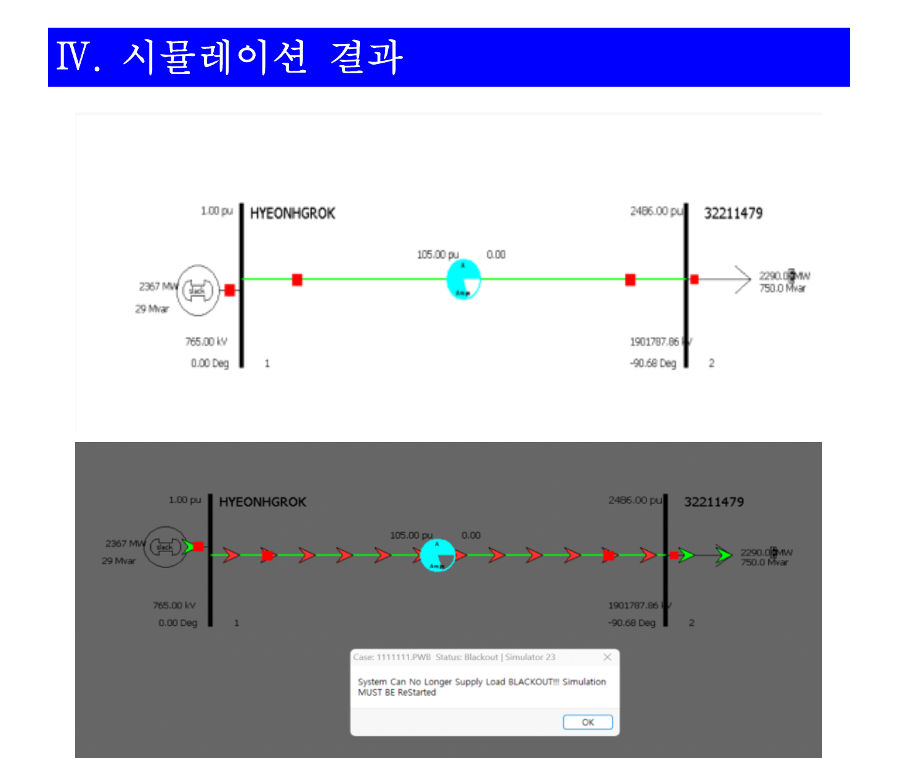
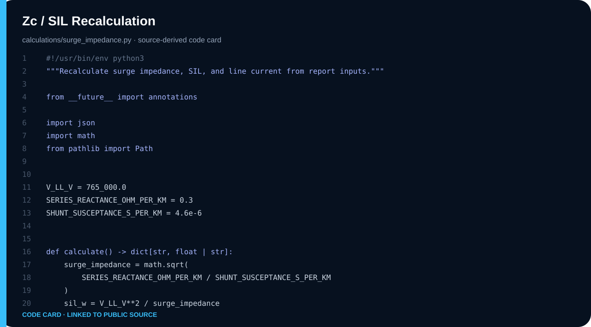

# Power Systems — 765 kV 송전선로와 전력정책 검토

**학기:** 3-1 · **프로젝트 유형:** Team Project · Individual contribution unconfirmed
**Evidence:** Source-Derived · Independent Recalculation · Existing Model Archive


## 30초 요약

분포정수 선로의 Zc·SIL을 재계산하고, PowerWorld 비수렴 결과와 정책 수치를 서로 다른 증거로 분리했습니다.

| 항목 | 내용 |
|---|---|
| 공개 상태 | Zc 255.38 Ω · SIL 2.292 GW |
| 소스 상태 | Source-Derived · Independent Recalculation · Existing Model Archive |
| Web case study | [https://tontonjeong.github.io/electrical-engineering-coursework-portfolio/courses/power-systems/](https://tontonjeong.github.io/electrical-engineering-coursework-portfolio/courses/power-systems/) |

## 문제 정의

계산 가능한 전송선로 파라미터, 수렴하지 않은 모델 화면, 정책 보고서 수치를 한 가지 ‘결과’로 묶지 않고 증거 수준을 분리하는 것이 핵심입니다. 선로 계산은 독립 재계산했고, 모델 비수렴은 디버깅 증거로만 남겼습니다.

## 설계 판단

1. 765 kV, 350 km, z=j0.3 Ω/km, y=j4.6 µS/km 조건으로 lossless Zc와 SIL을 계산했습니다.
2. 독립 계산 결과 Zc≈255.38 Ω, SIL≈2.292 GW, SIL 전류≈1.729 kA입니다.
3. PowerWorld full-load case의 비현실적 pu 전압과 blackout 상태는 실제 계통 성능으로 해석하지 않았습니다.
4. 2038 수요·피크·설비 수치는 보고서와 공개 정책 출처의 맥락을 분리해 표시했습니다.

## 구조와 설계 흐름



## 핵심 수치

| Metric | Value |
|---|---:|
| Voltage / length | 765 kV / 350 km |
| Surge impedance | 255.38 Ω |
| SIL | 2.292 GW |
| SIL current | 1.729 kA |
| 2038 energy | 735.1 → 624.5 TWh |
| 2038 peak | 145.6 → 129.3 GW |

## 시각 근거

### Distributed-line calculation flow

**Portfolio Redraw**



### 2038 energy demand comparison

**Source-Derived Redraw**



### 2038 peak-demand comparison

**Source-Derived Redraw**



### Confirmed effective capacity values

**Source-Derived Redraw**



### Recovered one-line model view

**Existing PowerWorld Archive**



### Non-convergence evidence; not a validated grid result

**Existing PowerWorld Archive**



## 코드 근거

### Zc, SIL, and current equations

**Independent Recalculation**



## 검증 상태

| 질문 | 답변 |
|---|---|
| 지금 재현 가능한가? | Zc 255.38 Ω · SIL 2.292 GW 범위에서 가능 |
| 과거 결과 화면인가? | Existing Result Archive로 표시된 항목만 해당 |
| 재구성인가? | Portable Reconstruction 또는 Portfolio Redraw로 표시 |
| 실물 구현인가? | 원본이 지원하지 않으면 주장하지 않음 |

## 검증 경계

> 동적 안정도, 보호계전, N-1, 실계통 조류 검증은 수행 증거가 없습니다. 비수렴 PowerWorld 화면은 모델 구축·오류 인지 증거이지 PASS가 아닙니다. 정책 보고서의 AI 보조 작성 사실도 숨기지 않습니다.

## 재현 절차

```bash
python scripts/run_all_calculations.py
python scripts/validate_publication.py
```

세부 소스와 계산은 이 디렉터리의 `src/`, `tb/`, `calculations/`, `data/`, `results/` 중 존재하는 경로를 참조합니다.

## Source classification

- **Source-Derived:** 보고서 또는 회수 소스에 직접 존재
- **Portable Reconstruction:** 공개 검증을 위해 기능을 재작성
- **Independent Recalculation:** 원본 입력을 별도 코드로 계산
- **Existing Result Archive:** 과거 제출물의 결과 화면
- **Portfolio Redraw:** 공개 설명을 위한 재도식화
- **Publicly Withheld:** 개인정보·라이선스·제3자 권리 때문에 미공개

## Navigation

- [Visual case study](https://tontonjeong.github.io/electrical-engineering-coursework-portfolio/courses/power-systems/)
- [Portfolio home](../../README.md)
- [Asset manifest](../../docs/assets/asset_manifest.yaml)
- [Source provenance](../../SOURCE_PROVENANCE.md)

<!-- Source-bounded case study; no unsupported claim is implied. -->

<!-- Source-bounded case study; no unsupported claim is implied. -->

<!-- Source-bounded case study; no unsupported claim is implied. -->

<!-- Source-bounded case study; no unsupported claim is implied. -->

<!-- Source-bounded case study; no unsupported claim is implied. -->

<!-- Source-bounded case study; no unsupported claim is implied. -->

<!-- Source-bounded case study; no unsupported claim is implied. -->

<!-- Source-bounded case study; no unsupported claim is implied. -->

<!-- Source-bounded case study; no unsupported claim is implied. -->

<!-- Source-bounded case study; no unsupported claim is implied. -->
