# Motor Control — 직류전동기 이중 PI 제어

**학기:** 3-2 · **프로젝트 유형:** Team Project · Individual contribution unconfirmed
**Evidence:** Recovered Original · Independent Recalculation · Existing PSIM/MATLAB Archive


## 30초 요약

500 Hz 전류 루프와 25 Hz 속도 루프, 전류 제한·anti-windup·field weakening을 하나의 제어 구조로 정리했습니다.

| 항목 | 내용 |
|---|---|
| 공개 상태 | Calculation + existing simulation archive |
| 소스 상태 | Recovered Original · Independent Recalculation · Existing PSIM/MATLAB Archive |
| Web case study | [https://tontonjeong.github.io/electrical-engineering-coursework-portfolio/courses/motor-control/](https://tontonjeong.github.io/electrical-engineering-coursework-portfolio/courses/motor-control/) |

## 문제 정의

전기적으로 빠른 전류 동특성과 느린 기계 속도 동특성을 분리해 cascade controller를 설계했습니다. 계산식, 회수 C/C++ 상수, 기존 PSIM/MATLAB 화면 사이의 차이를 숨기지 않고 parameter consistency audit로 관리했습니다.

## 설계 판단

1. 전류 루프 대역폭 500 Hz에서 Kp=62.832, Ki=314.16을 재계산했습니다.
2. 속도 루프 25 Hz의 보고서 값 Kp=24.8, Ki≈3898과 회수 소스 Ki=3895를 모두 보존했습니다.
3. 속도 지령은 0→850 rpm, hold, 850→1200 rpm 순서로 구성됩니다.
4. ±10 A current limit, ±200 V voltage saturation, field weakening 구간을 제어 흐름에 포함했습니다.

## 구조와 설계 흐름

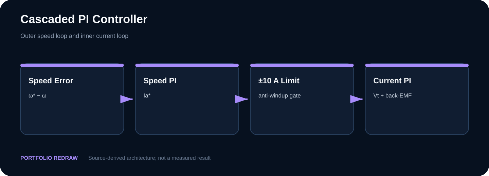

## 핵심 수치

| Metric | Value |
|---|---:|
| Current loop | 500 Hz |
| Current PI | 62.832 / 314.16 |
| Speed loop | 25 Hz |
| Speed PI | 24.8 / 3898 report |
| Source Ki | 3895 |
| Torque ripple | 2.28 → 0.38 N·m |

## 시각 근거

### 500 Hz inner-loop design

**Portfolio Redraw**

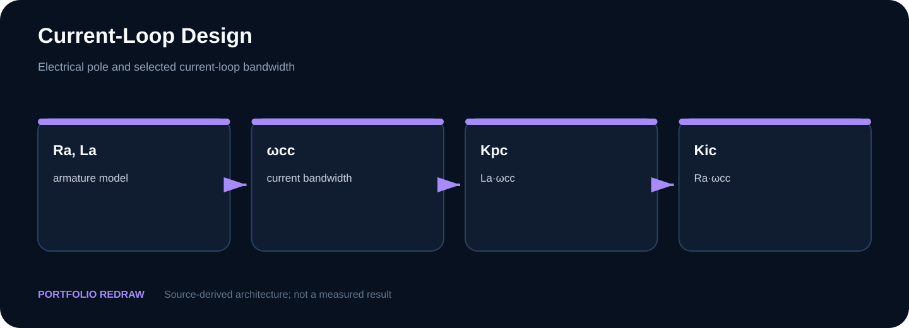

### 25 Hz outer-loop design

**Portfolio Redraw**

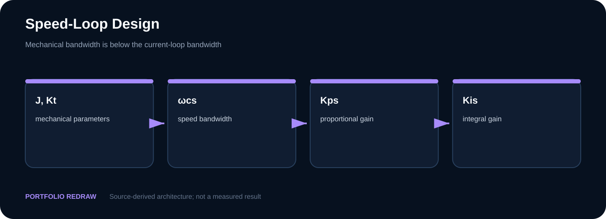

### Limiter and anti-windup behavior

**Portfolio Redraw**

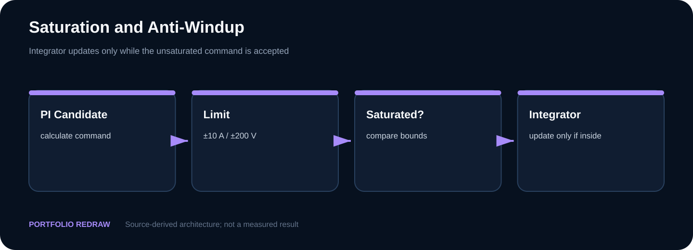

### Recovered simulation schematic

**Existing PSIM Archive**

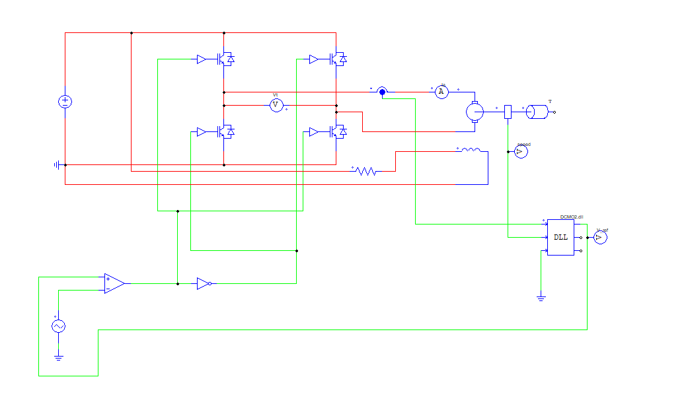

### Recovered speed response

**Existing PSIM Archive**

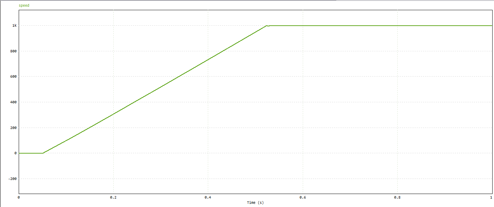

### Torque-ripple comparison

**Independent Recalculation**

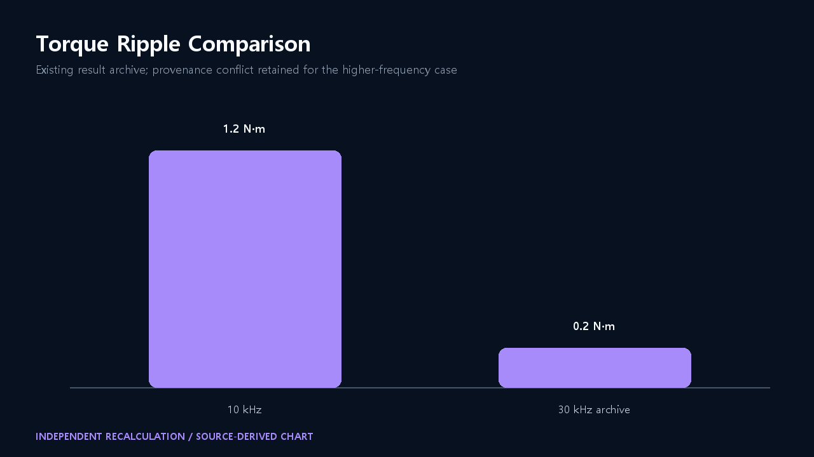

## 검토된 원본 시각 증거

고해상도 원본 후보를 전수 감사한 뒤 개인정보·학번·로컬 경로·제3자 교재를 제외한 공개 가능 산출물입니다.

### 0→850→1200 rpm reference profile

**Existing PSIM Archive**

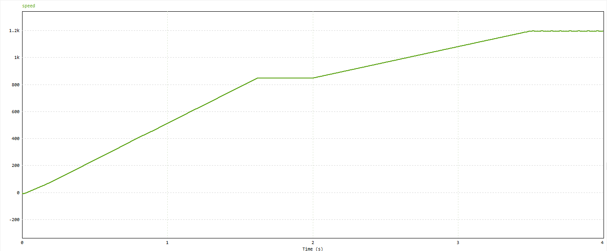

### Recovered MATLAB speed response

**Existing MATLAB Archive**

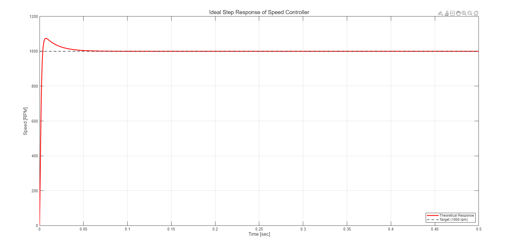

### Recovered PSIM current response

**Existing PSIM Archive**

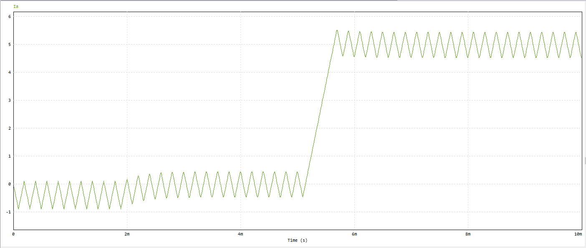

### Recovered MATLAB current response

**Existing MATLAB Archive**

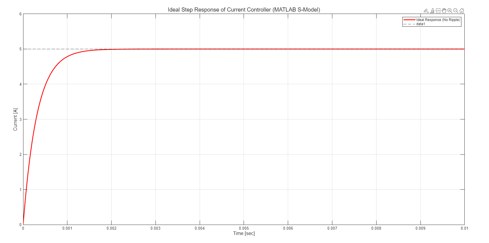

### Recovered field-weakening response

**Existing PSIM Archive**

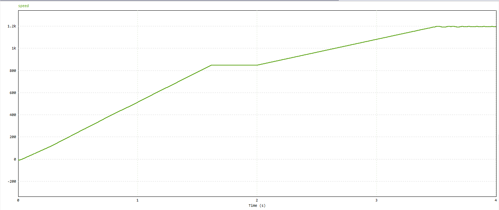

### Recovered torque-ripple case A

**Existing Result Archive**

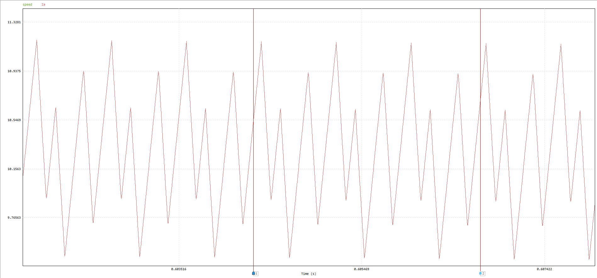

### Recovered torque-ripple case B

**Existing Result Archive**

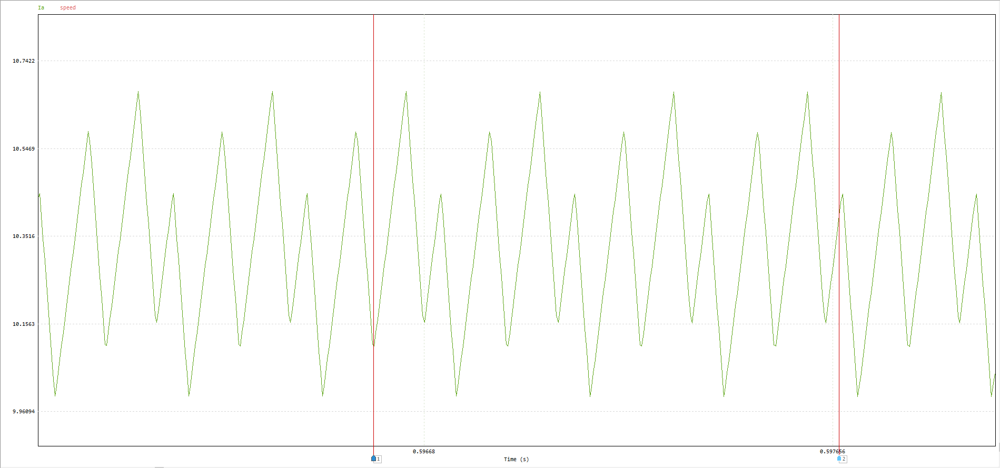

## 코드 근거

### 0→850→1200 rpm reference

**Recovered Original**

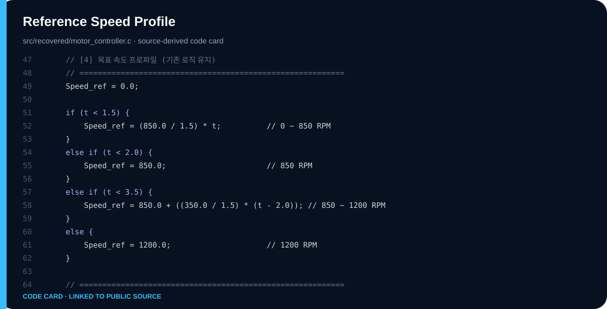

### Current PI and ±200 V saturation

**Recovered Original**

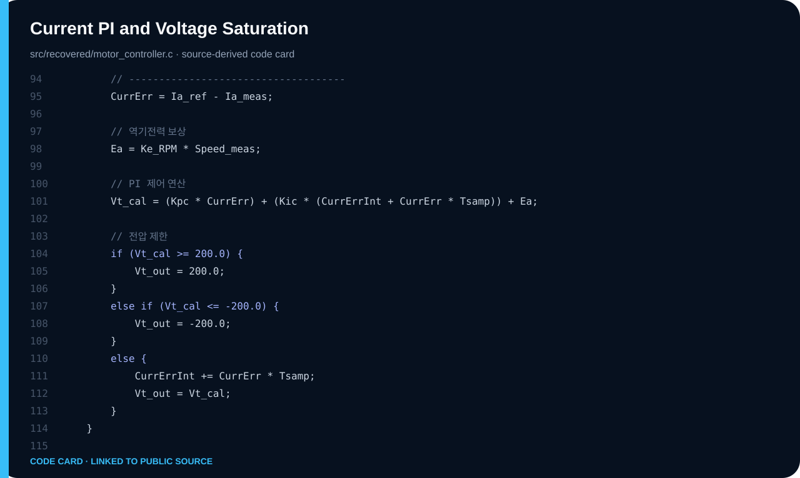

### Speed PI and ±10 A limit

**Recovered Original**

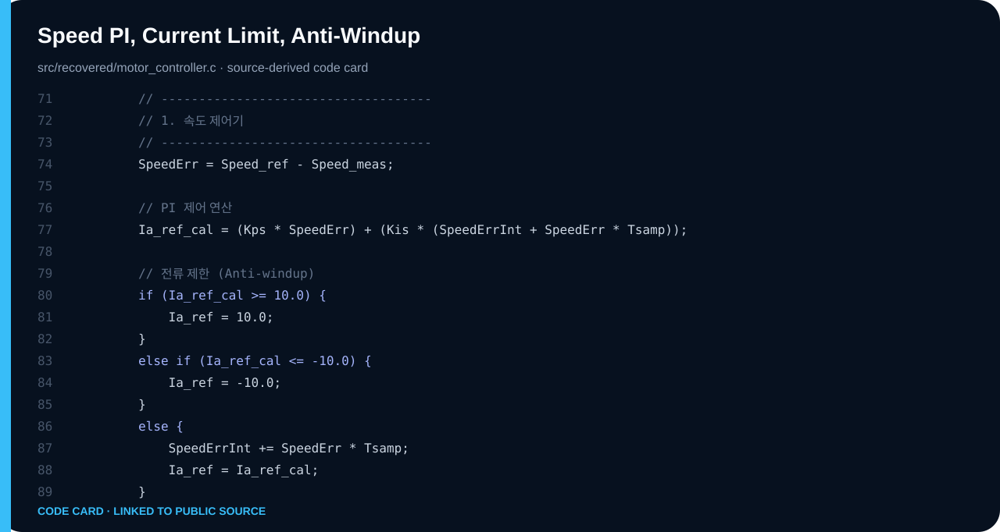

## 검증 상태

| 질문 | 답변 |
|---|---|
| 지금 재현 가능한가? | Calculation + existing simulation archive 범위에서 가능 |
| 과거 결과 화면인가? | Existing Result Archive로 표시된 항목만 해당 |
| 재구성인가? | Portable Reconstruction 또는 Portfolio Redraw로 표시 |
| 실물 구현인가? | 원본이 지원하지 않으면 주장하지 않음 |

## 검증 경계

> PSIM/MATLAB 프로젝트를 라이선스 독립적으로 재실행할 자료는 회수되지 않았습니다. 화면은 Existing Result Archive이며 새 실행 결과가 아닙니다. 파일명 25 kHz와 본문 30 kHz의 불일치는 그대로 표시합니다. 하드웨어 실험은 주장하지 않습니다.

## 재현 절차

```bash
python scripts/run_all_calculations.py
python scripts/validate_publication.py
```

세부 소스와 계산은 이 디렉터리의 `src/`, `tb/`, `calculations/`, `data/`, `results/` 중 존재하는 경로를 참조합니다.

## Source classification

- **Source-Derived:** 보고서 또는 회수 소스에 직접 존재
- **Portable Reconstruction:** 공개 검증을 위해 기능을 재작성
- **Independent Recalculation:** 원본 입력을 별도 코드로 계산
- **Existing Result Archive:** 과거 제출물의 결과 화면
- **Portfolio Redraw:** 공개 설명을 위한 재도식화
- **Publicly Withheld:** 개인정보·라이선스·제3자 권리 때문에 미공개

## Navigation

- [Visual case study](https://tontonjeong.github.io/electrical-engineering-coursework-portfolio/courses/motor-control/)
- [Portfolio home](../../README.md)
- [Asset manifest](../../docs/assets/asset_manifest.yaml)
- [Source provenance](../../SOURCE_PROVENANCE.md)
