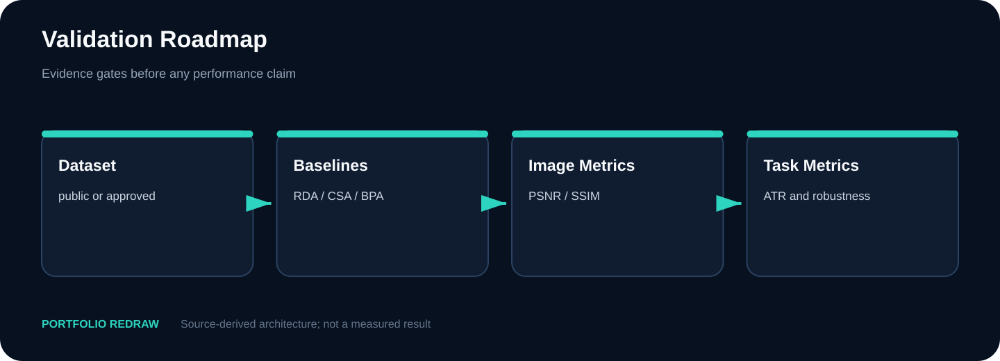
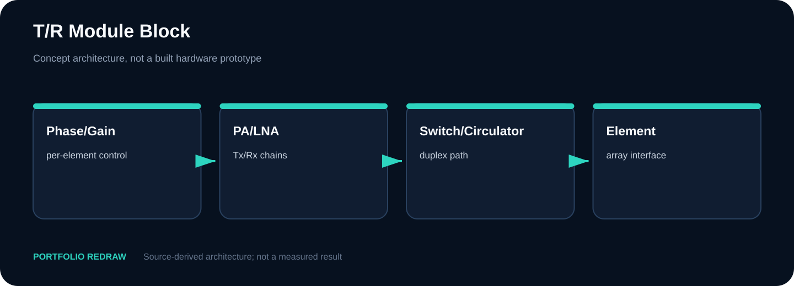
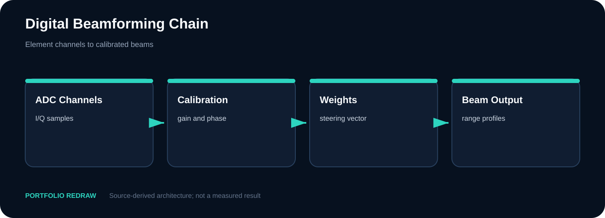
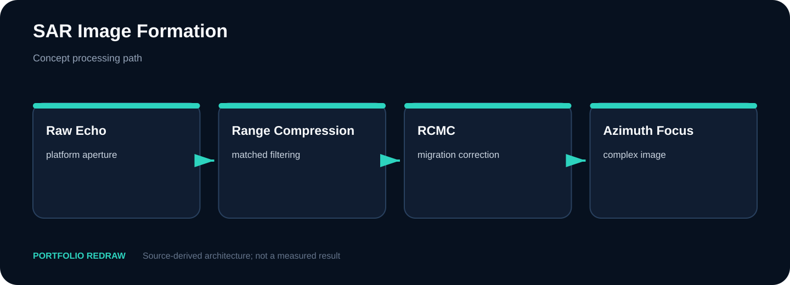
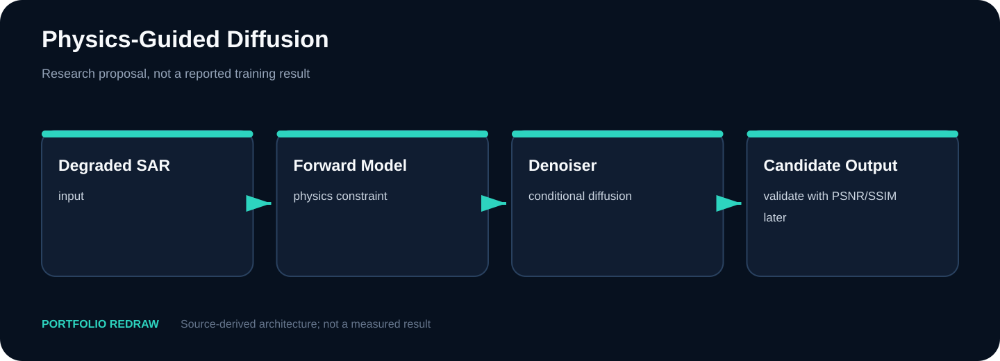
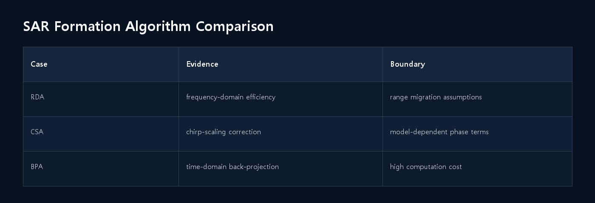
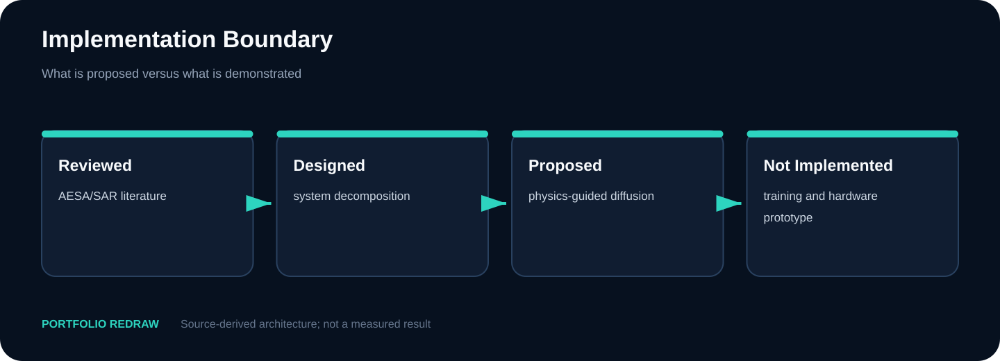

# Sensor Applications — AESA-SAR와 Physics-Guided Diffusion

**학기:** 4-1 · **프로젝트 유형:** Team Project · Individual contribution unconfirmed
**Evidence:** Research Concept · Architecture · Validation Roadmap · No Implemented Result


## AESA-SAR 연구 제안 범위

AESA 수집, SAR 복원, physics-conditioned diffusion을 연결한 연구 제안과 단계별 검증 로드맵입니다.

| 항목 | 내용 |
|---|---|
| 공개 상태 | Concept / Proposal Only |
| 소스 상태 | Research Concept · Architecture · Validation Roadmap · No Implemented Result |
| Web case study | [https://tontonjeong.github.io/electrical-engineering-coursework-portfolio/courses/sensor-applications/](https://tontonjeong.github.io/electrical-engineering-coursework-portfolio/courses/sensor-applications/) |

## 신호처리 baseline과 diffusion 적용 위치

AESA 하드웨어와 SAR 영상형성, 생성모델을 한 문장으로 묶는 대신 RF sensing, DBF, conventional reconstruction, conditional diffusion, evaluation으로 계층화했습니다. 이 페이지의 성과는 구현 결과가 아니라 검증 가능한 연구 설계입니다.

### 적용한 설계 조건

1. RDA/CSA/BPA 중 하나를 먼저 baseline으로 고정한 뒤 학습 모델과 비교하도록 했습니다.
2. 관측 열화·undersampling 조건과 train/validation/test 분리를 사전에 문서화합니다.
3. 영상 품질 지표와 physics-consistency 지표를 함께 사용하도록 제안했습니다.
4. conditioning과 loss term의 ablation, noise·model mismatch robustness를 검증 순서에 포함했습니다.

## 상세 근거와 분리된 하위 사례

- [Source/proposal evidence matrix](evidence_matrix.md)

## 설계 구조



## 현재 산출물

| Metric | Value |
|---|---:|
| Implementation | Not performed |
| Dataset | Not published |
| Hardware | Not built |
| Performance gain | Not claimed |
| Deliverable | Architecture + validation plan |

## 처리 블록과 검증 계획

### T/R module abstraction

**Portfolio Redraw**



### Digital beamforming chain

**Portfolio Redraw**



### Conventional SAR baseline

**Portfolio Redraw**



### Physics-conditioned refinement

**Portfolio Redraw**



### Baseline algorithm comparison

**Engineering Interpretation**



### Proposal versus implementation

**Evidence Boundary**



## Dataset·학습·prototype 부재

> 학습 모델, 데이터셋, AESA prototype, field/flight test, 정량 성능 향상은 존재한다고 주장하지 않습니다. 군사 운용 절차나 구현 가능한 공격 정보가 아니라 공개 가능한 시스템 계층과 검증 방법만 다룹니다.

## 보고서와 검증 계획

```bash
python scripts/run_all_calculations.py
python scripts/validate_publication.py
```

세부 소스·계산·로그는 실제 존재하는 `src/`, `tb/`, `calculations/`, `data/`, `results/` 경로에서 확인합니다.

- [Visual case study](https://tontonjeong.github.io/electrical-engineering-coursework-portfolio/courses/sensor-applications/)
- [Portfolio home](../../README.md)
- [Asset manifest](../../docs/assets/asset_manifest.yaml)
- [Source provenance](../../SOURCE_PROVENANCE.md)
