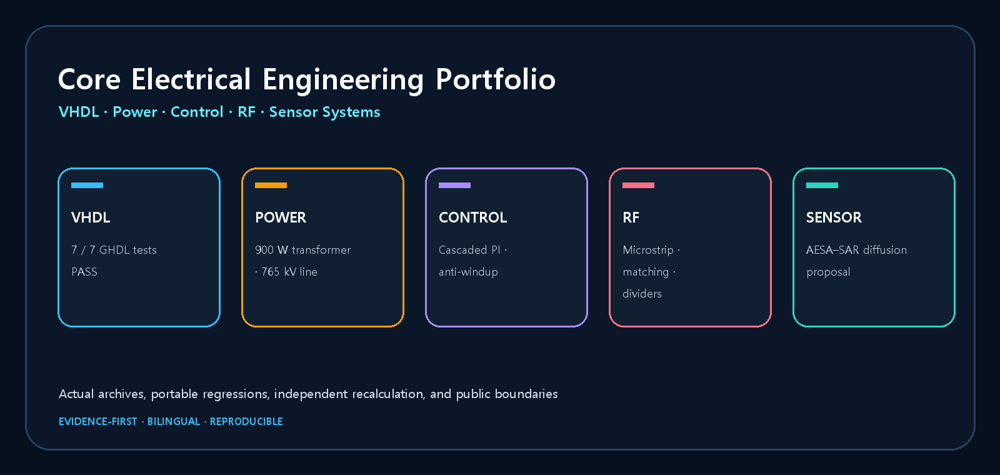
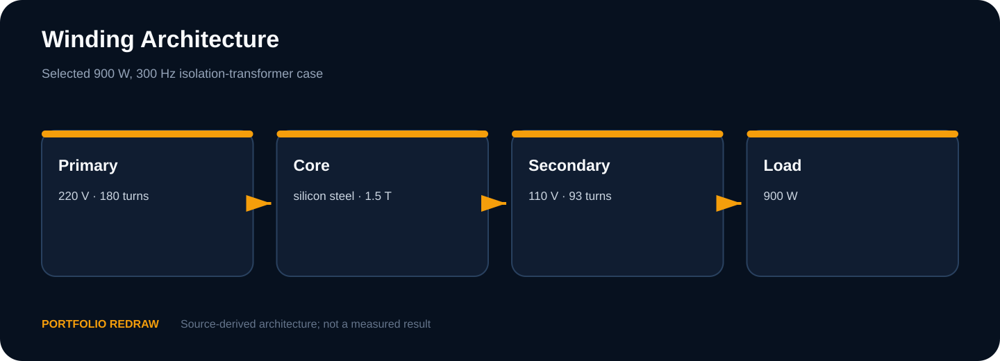
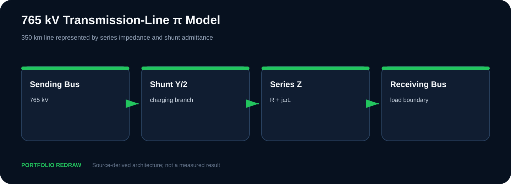
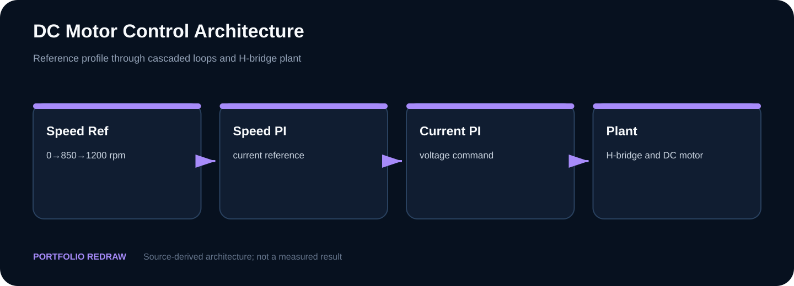
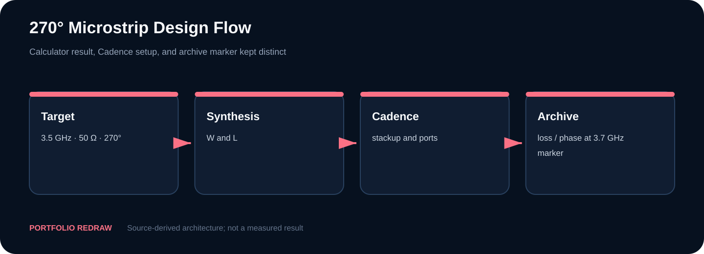
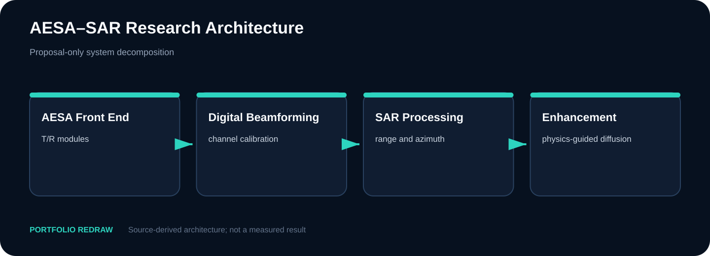

# Electrical Engineering Coursework Portfolio

[English](README.en.md) · [GitHub Pages](https://tontonjeong.github.io/electrical-engineering-coursework-portfolio/) · [Source Provenance](SOURCE_PROVENANCE.md)



단국대학교 전자전기공학 전공과목에서 수행한 설계·계산·RTL·시뮬레이션·연구 제안을 공개 가능한 근거로 다시 구성한 포트폴리오입니다.

## 포트폴리오 원칙

- Recovered Original: 제출물에서 회수한 직접 작성 소스
- Portable Reconstruction: 원본 기능을 공개 환경에서 다시 검증하기 위한 재구성
- Independent Recalculation: 보고서 입력과 식을 별도 코드로 재계산
- Existing Result Archive: 기존 PSIM·MATLAB·Cadence·PowerWorld 화면이며 현재 환경 재실행 아님
- Tool Rerun: 현재 설치된 도구에서 원본 파일을 다시 실행한 결과
- Portfolio Redraw: 원본 내용을 바탕으로 공개용으로 다시 그린 도식
- Concept / Proposal: 구현·학습·실증이 완료되지 않은 연구 설계

## 채용 담당자용 30초 요약

| Term | Case study | Core output | Evidence state |
|---|---|---|---|
| 2-2 | [Controller Logic — VHDL 설계와 Portable Verification](00_digital_hardware/controller_logic/README.md) | 조합회로에서 FSM·범용 시프트 레지스터까지 7개 RTL 블록을 self-checking testbench로 재검증했습니다. | GHDL 7/7 PASS |
| 3-1 | [Electrical Machines — 900 W 변압기 설계](01_electrical_machines/transformer_design/README.md) | 220/110 V, 900 W, 300 Hz 조건에서 DU·EI·UI 코어를 계산 비교하고 UI-100 설계를 선택했습니다. | Independent recalculation |
| 3-1 | [Power Systems — 765 kV 송전선로와 전력정책 검토](02_power_systems/transmission_line_and_policy/README.md) | 분포정수 선로의 Zc·SIL을 재계산하고, PowerWorld 비수렴 결과와 정책 수치를 서로 다른 증거로 분리했습니다. | Zc 255.38 Ω · SIL 2.292 GW · PWB rerun: Blackout |
| 3-2 | [Motor Control — 직류전동기 이중 PI 제어](03_motor_control/dc_motor_pi_control/README.md) | 500 Hz 전류 루프와 25 Hz 속도 루프, 전류 제한·anti-windup·field weakening을 하나의 제어 구조로 정리했습니다. | Calculation + existing simulation archive |
| 4-1 | [RF/Microwave — 수동회로 설계와 Cadence 결과](04_rf_microwave/passive_network_design/README.md) | Microstrip, L-section·single-stub matching, Wilkinson divider, branch-line hybrid를 이론과 기존 Cadence 결과로 비교했습니다. | Theory + existing Cadence archive |
| 4-1 | [Sensor Applications — AESA-SAR와 Physics-Guided Diffusion](05_sensor_applications/aesa_sar_diffusion_concept/README.md) | AESA 수집, SAR 복원, physics-conditioned diffusion을 연결한 연구 제안과 단계별 검증 로드맵입니다. | Concept / Proposal Only |

## Visual Case Study 지도

### 1. Controller Logic — VHDL 설계와 Portable Verification


조합회로에서 FSM·범용 시프트 레지스터까지 7개 RTL 블록을 self-checking testbench로 재검증했습니다.

- **Status:** GHDL 7/7 PASS
- **Evidence:** Recovered Original · Portable Reconstruction · GHDL Rerun
- **Source:** [00_digital_hardware/controller_logic](00_digital_hardware/controller_logic/)
- **Web:** [Visual case study](https://tontonjeong.github.io/electrical-engineering-coursework-portfolio/courses/controller-logic/)

- Design units: 7
- Recovered Vivado projects: 4
- Original stimuli: 4 STIMULUS_COMPLETE
- Self-checking TB: 7
- Regression: 7 PASS / 0 FAIL
- Local tool: GHDL 6.0.0 mcode

> 원본 Vivado 2023.2 프로젝트와 XSim context 4건은 회수했지만, device constraint, synthesis/timing report, 보드 실증은 없습니다. 원본 testbench에는 assertion이 없어 STIMULUS_COMPLETE로만 표시하고, PASS는 별도 self-checking GHDL 6.0.0 suite에만 부여합니다. LUT/FF, Fmax, 전력, hardware PASS는 주장하지 않습니다.

### 2. Electrical Machines — 900 W 변압기 설계



220/110 V, 900 W, 300 Hz 조건에서 DU·EI·UI 코어를 계산 비교하고 UI-100 설계를 선택했습니다.

- **Status:** Independent recalculation
- **Evidence:** Source-Derived · Workbook Snapshot · Independent Recalculation
- **Source:** [01_electrical_machines/transformer_design](01_electrical_machines/transformer_design/)
- **Web:** [Visual case study](https://tontonjeong.github.io/electrical-engineering-coursework-portfolio/courses/electrical-machines/)

- Primary / secondary: 180 / 93 turns
- Copper loss: 10.2267 W
- Core loss: 23.7760 W
- Efficiency: 96.360%
- Regulation: 1.136%

> 최종 제작, 온도상승, 절연 내력, 무부하·단락 시험의 실물 증거는 확인되지 않았습니다. 결과는 계산 기반 설계입니다. Workbook 화면은 셀 값을 렌더링한 snapshot이며 Excel 애플리케이션 실행 화면이 아닙니다.

### 3. Power Systems — 765 kV 송전선로와 전력정책 검토



분포정수 선로의 Zc·SIL을 재계산하고, PowerWorld 비수렴 결과와 정책 수치를 서로 다른 증거로 분리했습니다.

- **Status:** Zc 255.38 Ω · SIL 2.292 GW · PWB rerun: Blackout
- **Evidence:** Source-Derived · Independent Recalculation · PowerWorld 24 Tool Rerun
- **Source:** [02_power_systems/transmission_line_and_policy](02_power_systems/transmission_line_and_policy/)
- **Web:** [Visual case study](https://tontonjeong.github.io/electrical-engineering-coursework-portfolio/courses/power-systems/)

- Voltage / length: 765 kV / 350 km
- Surge impedance: 255.38 Ω
- SIL: 2.292 GW
- SIL current: 1.729 kA
- PowerWorld 24 rerun: 2214 MW → Blackout
- 2038 energy: 735.1 → 624.5 TWh
- 2038 peak: 145.6 → 129.3 GW

> PowerWorld 24 재실행은 2214 MW 저장 상태에서 Blackout 진단을 확인한 것이며, 보고서의 3000/3100/3200 MW 단계나 5380 MW 보상 사례를 검증한 것이 아닙니다. 동적 안정도, 보호계전, N-1, 실계통 검증은 주장하지 않습니다. 화면의 이름·학번은 공개하지 않습니다.

### 4. Motor Control — 직류전동기 이중 PI 제어



500 Hz 전류 루프와 25 Hz 속도 루프, 전류 제한·anti-windup·field weakening을 하나의 제어 구조로 정리했습니다.

- **Status:** Calculation + existing simulation archive
- **Evidence:** Recovered Original · Independent Recalculation · Existing PSIM/MATLAB Archive
- **Source:** [03_motor_control/dc_motor_pi_control](03_motor_control/dc_motor_pi_control/)
- **Web:** [Visual case study](https://tontonjeong.github.io/electrical-engineering-coursework-portfolio/courses/motor-control/)

- Current loop: 500 Hz
- Current PI: 62.832 / 314.16
- Speed loop: 25 Hz
- Speed PI: 24.8 / 3898 report
- Source Ki: 3895
- Torque ripple: 2.28 → 0.38 N·m

> PSIM/MATLAB 프로젝트를 라이선스 독립적으로 재실행할 자료는 회수되지 않았습니다. 화면은 Existing Result Archive이며 새 실행 결과가 아닙니다. 파일명 25 kHz와 본문 30 kHz의 불일치는 그대로 표시합니다. 하드웨어 실험은 주장하지 않습니다.

### 5. RF/Microwave — 수동회로 설계와 Cadence 결과



Microstrip, L-section·single-stub matching, Wilkinson divider, branch-line hybrid를 이론과 기존 Cadence 결과로 비교했습니다.

- **Status:** Theory + existing Cadence archive
- **Evidence:** Source-Derived · Portfolio Redraw · Existing Cadence Result Archive
- **Source:** [04_rf_microwave/passive_network_design](04_rf_microwave/passive_network_design/)
- **Web:** [Visual case study](https://tontonjeong.github.io/electrical-engineering-coursework-portfolio/courses/rf-microwave/)

- Microstrip target: 3.5 GHz · 50 Ω · 270°
- Calculated W / L: 0.4815 / 24.97 mm
- Archive marker: 3.7 GHz only
- L-section: 0.461 pF · 19.5 nH
- Wilkinson split: ≈ −3 dB archive
- Isolation: ≈ −18 dB archive

> Cadence 프로젝트와 라이선스 자료는 공개하지 않습니다. 3.7 GHz marker를 3.5 GHz의 정확한 검증으로 바꾸어 말하지 않습니다. 제작 공차, connector launch, calibration, VNA 측정은 증거 범위 밖입니다.

### 6. Sensor Applications — AESA-SAR와 Physics-Guided Diffusion



AESA 수집, SAR 복원, physics-conditioned diffusion을 연결한 연구 제안과 단계별 검증 로드맵입니다.

- **Status:** Concept / Proposal Only
- **Evidence:** Research Concept · Architecture · Validation Roadmap · No Implemented Result
- **Source:** [05_sensor_applications/aesa_sar_diffusion_concept](05_sensor_applications/aesa_sar_diffusion_concept/)
- **Web:** [Visual case study](https://tontonjeong.github.io/electrical-engineering-coursework-portfolio/courses/sensor-applications/)

- Implementation: Not performed
- Dataset: Not published
- Hardware: Not built
- Performance gain: Not claimed
- Deliverable: Architecture + validation plan

> 학습 모델, 데이터셋, AESA prototype, field/flight test, 정량 성능 향상은 존재한다고 주장하지 않습니다. 군사 운용 절차나 구현 가능한 공격 정보가 아니라 공개 가능한 시스템 계층과 검증 방법만 다룹니다.

## Interactive Calculator

| Tool | Scope | Link |
|---|---|---|
| Transformer Case | Loss, efficiency, regulation | [https://tontonjeong.github.io/electrical-engineering-coursework-portfolio/tools/transformer-case-calculator/](https://tontonjeong.github.io/electrical-engineering-coursework-portfolio/tools/transformer-case-calculator/) |
| Motor PI | Current-loop gains + preserved discrepancy | [https://tontonjeong.github.io/electrical-engineering-coursework-portfolio/tools/motor-pi-calculator/](https://tontonjeong.github.io/electrical-engineering-coursework-portfolio/tools/motor-pi-calculator/) |
| Transmission Line | Zc, SIL, current | [https://tontonjeong.github.io/electrical-engineering-coursework-portfolio/tools/transmission-line-calculator/](https://tontonjeong.github.io/electrical-engineering-coursework-portfolio/tools/transmission-line-calculator/) |

## 저장소 구조

```text
00_digital_hardware/      VHDL sources, testbenches, VCD results
01_electrical_machines/   transformer calculations and workbook audit
02_power_systems/         line arithmetic, policy reconciliation
03_motor_control/         PI calculations, recovered source, archived plots
04_rf_microwave/          passive network cases and Cadence archive
05_sensor_applications/   AESA-SAR research architecture
docs/                     bilingual multi-page portfolio and visual assets
scripts/                  calculation, build, and publication QA
```

## 재현과 검증

```bash
python scripts/run_all_calculations.py
python scripts/build_visual_assets.py
python scripts/build_coursework_site.py
python scripts/validate_svg_bounds.py
node scripts/test_calculators.mjs
python scripts/validate_publication.py
```

공개 CI는 가능한 범위에서 GHDL과 g++를 사용합니다.

## 검증 매트릭스

| Area | Reproducible now | Archive only | Not claimed |
|---|---|---|---|
| Controller Logic | GHDL 6.0.0: 7/7 PASS + 4 original stimuli | Vivado/XSim projects recovered | FPGA timing / board result |
| Transformer | Python loss/efficiency check | Workbook snapshots | Fabrication and hardware tests |
| Power Systems | Zc/SIL arithmetic + PowerWorld 24 blackout rerun | report load-stage screenshots | Validated production grid flow |
| Motor Control | PI/ripple calculations | PSIM/MATLAB screenshots | New licensed simulation or hardware test |
| RF/Microwave | Source-derived equations | Cadence screenshots | VNA measurement / exact 3.5 GHz rerun |
| Sensor Applications | Architecture review plan | None | Dataset, model, prototype, gain |

## 공개 범위와 기여도

개인정보, 학번, 로컬 경로, 라이선스 종속 프로젝트, 제3자 교재는 공개하지 않습니다.

팀 과제는 작성자가 역할을 확정하기 전까지 **Team Project · Individual contribution unconfirmed**로 표시합니다.

See [ROLE_CONFIRMATION_REQUIRED.md](ROLE_CONFIRMATION_REQUIRED.md), [PUBLICATION_MATRIX.md](PUBLICATION_MATRIX.md), and [LICENSE_NOTICE.md](LICENSE_NOTICE.md).

## 시각 자료 추적성

Every generated/cropped asset is listed in [`docs/assets/asset_manifest.yaml`](docs/assets/asset_manifest.yaml). Labels on the site distinguish archive, redraw, recalculation, and proposal evidence.

## Visual source audit

The July 2026 archive audit inventories standalone and embedded visuals, exact/near duplicates, privacy decisions, preferred sources, and public coverage.

- [All source visuals](docs/audit/all_source_visuals.md)
- [Missing visuals report](docs/audit/missing_visuals_report.md)
- [Unused high-value visuals](docs/audit/unused_high_value_visuals.md)
- [Disposition matrix](docs/audit/visual_disposition_matrix.csv)
- [Contact sheets](docs/audit/contact_sheets/)

## License notice

The repository license applies only to public, directly authored or reconstructed material. Withheld originals and third-party material are not relicensed.

<!-- Evidence-aware portfolio: claims remain bounded by the source and manifest. -->

<!-- Evidence-aware portfolio: claims remain bounded by the source and manifest. -->

<!-- Evidence-aware portfolio: claims remain bounded by the source and manifest. -->

<!-- Evidence-aware portfolio: claims remain bounded by the source and manifest. -->

<!-- Evidence-aware portfolio: claims remain bounded by the source and manifest. -->

<!-- Evidence-aware portfolio: claims remain bounded by the source and manifest. -->

<!-- Evidence-aware portfolio: claims remain bounded by the source and manifest. -->

<!-- Evidence-aware portfolio: claims remain bounded by the source and manifest. -->

<!-- Evidence-aware portfolio: claims remain bounded by the source and manifest. -->

<!-- Evidence-aware portfolio: claims remain bounded by the source and manifest. -->

<!-- Evidence-aware portfolio: claims remain bounded by the source and manifest. -->

<!-- Evidence-aware portfolio: claims remain bounded by the source and manifest. -->

<!-- Evidence-aware portfolio: claims remain bounded by the source and manifest. -->

<!-- Evidence-aware portfolio: claims remain bounded by the source and manifest. -->

<!-- Evidence-aware portfolio: claims remain bounded by the source and manifest. -->

<!-- Evidence-aware portfolio: claims remain bounded by the source and manifest. -->

<!-- Evidence-aware portfolio: claims remain bounded by the source and manifest. -->

<!-- Evidence-aware portfolio: claims remain bounded by the source and manifest. -->

<!-- Evidence-aware portfolio: claims remain bounded by the source and manifest. -->

<!-- Evidence-aware portfolio: claims remain bounded by the source and manifest. -->

<!-- Evidence-aware portfolio: claims remain bounded by the source and manifest. -->

<!-- Evidence-aware portfolio: claims remain bounded by the source and manifest. -->

<!-- Evidence-aware portfolio: claims remain bounded by the source and manifest. -->

<!-- Evidence-aware portfolio: claims remain bounded by the source and manifest. -->

<!-- Evidence-aware portfolio: claims remain bounded by the source and manifest. -->
